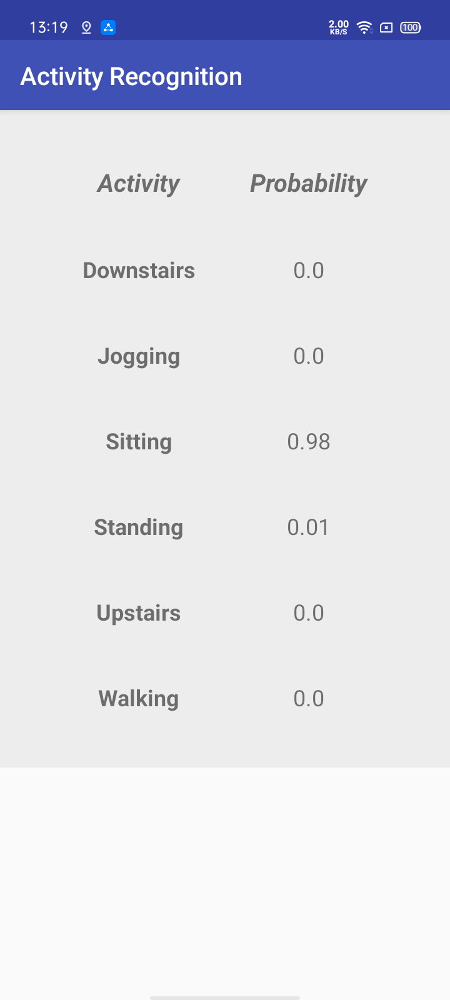

# TensorFlow on Android for Human Activity Recognition with LSTMs

Full explanation can be found in [this blog post](https://www.curiousily.com/posts/human-activity-recognition-using-lstms-on-android/). The source code is compatible with TensorFlow 1.1

### Hands-On Machine Learning from Scratch

Interested in deeper understanding of Machine Learning algorithms? Implement them in Python from scratch:

<a href="https://leanpub.com/hmls" target="_blank">Read the book here</a>

---

### My Environments (2021)

- Android SDK Platform 28 (Android 9.0 Pie)
- Android SDK Build-Tools 30.0.3 (Higher version Supports lower version)
- a Android *Phone* with Android 10 OS (Support lower SDK built apps I guess)

**It works fine on my phone!**

### Changes Should be Made to Run Locally

- `gradle-wrapper.properties`
  - To fit your own `gradle` version. 
  - BTW, my written version works fine, you can let it run.
- `build.gradle`
  - Top-level
  - Change to your local **repositories**, I used `aliyun`
- `build.gradle`
  - App-level
  - `compileSdkVersion`
  - `buildToolsVersion`
  - `targetSdkVersion`

